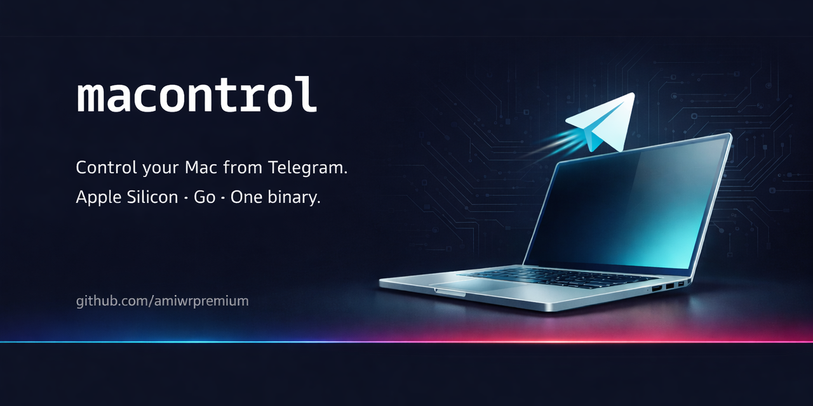

<p align="center">
  
</p>

# macontrol

> Control your Mac from Telegram — system, media, network, power, and more.
> Apple Silicon · Go · single binary.

[](https://github.com/amiwrpremium/macontrol/actions/workflows/ci.yml)
[](https://github.com/amiwrpremium/macontrol/releases)
[](https://pkg.go.dev/github.com/amiwrpremium/macontrol)
[](LICENSE)
[](https://www.conventionalcommits.org)

`macontrol` is a tiny Go daemon that runs on your Mac and exposes a
**menu-first Telegram bot** for remote control: change volume / brightness,
toggle Wi-Fi / Bluetooth, read battery & system stats, take screenshots,
send desktop notifications, lock / sleep / restart, and more.

<!-- TODO: insert assets/demo.gif once recorded on a real Mac -->
<!-- demo: home → Sound → −5 → Refresh → Main menu -->

## Features

| Category | What you can do |
|---|---|
| 🔊 Sound | Volume ± / set / mute / max |
| 💡 Display | Brightness ± / set, trigger screen saver |
| 🔋 Battery | Percent, charging state, health, cycle count |
| 📶 Wi-Fi | Toggle, info, join network, DNS presets, speed test |
| 🔵 Bluetooth | Toggle, list, connect/disconnect paired devices |
| ⚡ Power | Lock, sleep, restart, shutdown, logout, keep-awake |
| 🖥 System | macOS/HW info, thermal pressure, memory, CPU, top N, kill proc |
| 📸 Media | Full/display/window screenshot, screen recording, webcam photo |
| 🔔 Notify | Desktop notification (terminal-notifier → osascript fallback), text-to-speech |
| 🛠 Tools | Clipboard get/set, timezone pick, time sync, disks list, run any Shortcut |

## Install

### Homebrew (recommended)

```bash
brew install amiwrpremium/tap/macontrol
macontrol setup                 # interactive wizard
brew services start macontrol
```

### Manual

```bash
curl -fsSL https://raw.githubusercontent.com/amiwrpremium/macontrol/master/scripts/install.sh | sh
macontrol setup
macontrol service install       # writes LaunchAgent plist, launchctl-loads it
```

Apple Silicon, macOS 11 (Big Sur) or newer. Intel is not supported.

For build-from-source, install-script internals, and uninstall steps,
see [docs/getting-started/installation.md](docs/getting-started/installation.md).

## Documentation

The [`docs/`](docs/) directory is the full reference. Pick a group:

| Group | What's there |
|---|---|
| [Getting started](docs/getting-started/) | Install → credentials → quickstart → first message |
| [Usage](docs/usage/) | UX model, slash commands, every button in every category |
| [Configuration](docs/configuration/) | Env vars, file paths, whitelist management |
| [Permissions](docs/permissions/) | TCC grants and the narrow sudoers entry |
| [Operations](docs/operations/) | Running, logs, doctor, upgrades |
| [Architecture](docs/architecture/) | Overview, project layout, design decisions, testing |
| [Reference](docs/reference/) | CLI flags, callback protocol, macOS CLI mapping, version gates |
| [Security](docs/security/) | Bot token hygiene, threat model, vulnerability reporting |
| [Troubleshooting](docs/troubleshooting/) | Common issues, permission errors, Telegram errors |
| [Development](docs/development/) | Contributing, conventional commits, adding a capability, releasing |
| [FAQ](docs/faq.md) | Quick answers grouped by topic |

## Quick reference

### Telegram setup in 60 seconds

1. Create a bot with [@BotFather](https://t.me/BotFather), copy the token.
2. Get your Telegram user ID from [@userinfobot](https://t.me/userinfobot).
3. `macontrol setup` — paste both, the wizard does the rest.
4. Send `/start` to your bot.

Full walkthrough: [docs/getting-started/credentials-telegram.md](docs/getting-started/credentials-telegram.md).

### UX model in three lines

- `/menu` sends an inline keyboard with one button per category.
- Tapping a category edits the message into that category's dashboard, which itself edits in place as you tap (`+5`, `MUTE`, `🔄 Refresh`, …).
- Free-text input (set exact volume, join wifi, …) drops into a 5-min flow.

Deep explanation: [docs/usage/ux-model.md](docs/usage/ux-model.md).

## Development

```bash
make lint test            # golangci-lint + go test -race
make build                # cross-compile for darwin/arm64
make run                  # run locally against a dev bot token
```

Conventional Commits required for PR titles. Releases are cut by
[release-please](https://github.com/googleapis/release-please) — merging
the version PR triggers GoReleaser, which builds the tarball and updates
the Homebrew tap automatically.

Full guide: [docs/development/](docs/development/).

## Security

Never share your bot token. macontrol enforces a hard user-ID whitelist;
non-whitelisted updates are dropped silently.

Report vulnerabilities privately via
[GitHub Security Advisories](https://github.com/amiwrpremium/macontrol/security/advisories/new) —
see [SECURITY.md](SECURITY.md) and
[docs/security/](docs/security/).

## Disclaimer

`macontrol` is provided **as is**, without warranty of any kind, express or
implied — see the [MIT License](LICENSE) for the full text.

By installing and running this software you acknowledge and accept that:

- **It controls your Mac.** The bot can lock, restart, shut down, or log out
  your session; take screenshots and webcam photos; record your screen;
  change DNS and Wi-Fi settings; and run any Shortcut you have configured.
  Misuse, misconfiguration, or compromise of the bot token or your Telegram
  account can lead to data loss, privacy exposure, or other harm to you or
  your machine.
- **You are responsible for the bot token and the whitelist.** Anyone with
  the token can act as your bot; anyone whose Telegram user ID is on the
  whitelist has the same control over your Mac that you do.
- **You are responsible for third-party trust anchors.** macontrol shells
  out to macOS CLIs (`pmset`, `networksetup`, `security`, …) and optional
  Homebrew formulae (`brightness`, `blueutil`, `smctemp`, `imagesnap`,
  `terminal-notifier`). Telegram, Apple, and Homebrew sit outside the
  author's control.
- **The author (`@amiwrpremium`) is not liable** for damages, data loss,
  privacy incidents, unauthorized access, or any other harm resulting from
  the use, misuse, or failure of this software — whether direct, indirect,
  incidental, or consequential.
- **No support guarantees.** This is a personal project. Issues and pull
  requests are welcome, but there is no SLA, no paid support, and no
  commitment to fix any specific bug.
- **Use at your own risk.**

## License

MIT. See [LICENSE](LICENSE).
