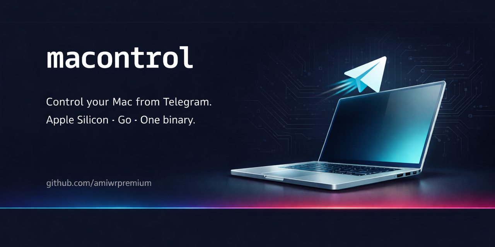

<p align="center">
  
</p>

# macontrol

> Control your Mac from Telegram — system, media, network, power.
> Self-hosted · no cloud middleman · named commands only · Apple Silicon · Go.

[](docs/architecture/design-decisions.md)
[](go.mod)
[](LICENSE)
[](https://github.com/amiwrpremium/macontrol/releases)
[](https://github.com/amiwrpremium/homebrew-tap)

[](docs/reference/version-gates.md)
[](docs/reference/version-gates.md)
[](docs/reference/version-gates.md)
[](docs/reference/version-gates.md)
[](docs/reference/version-gates.md)
[](docs/reference/version-gates.md)

<!-- Workflows -->
[](https://github.com/amiwrpremium/macontrol/actions/workflows/ci.yml)
[](https://github.com/amiwrpremium/macontrol/actions/workflows/extra-lint.yml)
[](https://github.com/amiwrpremium/macontrol/actions/workflows/pin-check.yml)

<!-- Security scans -->
[](https://github.com/amiwrpremium/macontrol/actions/workflows/codeql.yml)
[](https://github.com/amiwrpremium/macontrol/actions/workflows/gitleaks.yml)
[](https://github.com/amiwrpremium/macontrol/actions/workflows/trufflehog.yml)
[](https://github.com/amiwrpremium/macontrol/actions/workflows/gosec.yml)
[](https://github.com/amiwrpremium/macontrol/actions/workflows/trivy.yml)
[](https://pkg.go.dev/golang.org/x/vuln/cmd/govulncheck)

<!-- Supply chain & releases -->
[](https://www.bestpractices.dev/projects/12643)
[](https://scorecard.dev/viewer/?uri=github.com/amiwrpremium/macontrol)
[](https://slsa.dev)
[](https://github.com/amiwrpremium/macontrol/releases/latest)
[](https://github.com/amiwrpremium/macontrol/releases/latest)
[](https://github.com/amiwrpremium/macontrol/actions/workflows/license-check.yml)
[](./SECURITY.md)

<!-- Coverage & code quality -->
[](https://codecov.io/gh/amiwrpremium/macontrol)
[](https://app.codacy.com/gh/amiwrpremium/macontrol/dashboard)
[](https://app.codacy.com/gh/amiwrpremium/macontrol/dashboard)
[](https://goreportcard.com/report/github.com/amiwrpremium/macontrol)

<!-- Release & versioning -->
[](https://www.conventionalcommits.org)
[](https://github.com/googleapis/release-please)
[](https://github.com/amiwrpremium/macontrol/commits/master)

<!-- Project info & community -->
[](./CODE_OF_CONDUCT.md)
[](https://renovatebot.com/)
[](.github/dependabot.yml)
[](https://github.com/amiwrpremium/macontrol/commits/master)
[](https://github.com/amiwrpremium/macontrol/stargazers)

**[Why](#why) · [Features](#features) · [Install](#install) · [Compatibility](#compatibility) · [Documentation](#documentation) · [Quick reference](#quick-reference) · [Architecture](#architecture) · [Permissions](#permissions) · [Development](#development) · [Continuous integration](#continuous-integration) · [Repository secrets](#required-repository-secrets) · [Versioning](#versioning) · [Project files](#project-files) · [Security](#security) · [Disclaimer](#disclaimer) · [Related projects](#related-projects) · [Acknowledgments](#acknowledgments) · [License](#license)**

`macontrol` is a tiny Go daemon that runs on your Mac and exposes a
**menu-first Telegram bot** for remote control: change volume / brightness,
toggle Wi-Fi / Bluetooth, read battery & system stats, take screenshots,
send desktop notifications, lock / sleep / restart, and more.

<!-- TODO: insert assets/demo.gif once recorded on a real Mac -->
<!-- demo: home → Sound → −5 → Refresh → Main menu -->

## Why

For when you're away from your Mac and need to lock it, take a screenshot,
peek at battery or Wi-Fi state, or run one of your Shortcuts — without
exposing SSH, without a SaaS middleman, without paying anyone.

The daemon lives on your Mac, talks to Telegram via outbound long-poll
only (no inbound port), keeps secrets in the macOS Keychain, and uses
a hard Telegram-user-ID whitelist as the auth boundary. Named commands
only — no `/sh` escape hatch — so a leaked token alone can't run arbitrary
code on your Mac.

## Features

| Category | What you can do |
|---|---|
| 🔊 Sound | Volume ± / set / mute / max |
| 💡 Display | Brightness ± / set, trigger screen saver |
| 🔋 Battery | Percent, charging state, health, cycle count |
| 📶 Wi-Fi | Toggle, info (SSID + BSSID + RSSI + Security + channel), join network, DNS presets, speed test |
| 🔵 Bluetooth | Toggle, list, connect/disconnect paired devices |
| ⚡ Power | Lock, sleep, restart, shutdown, logout, keep-awake |
| 🖥 System | macOS/HW info, thermal pressure, memory + tappable top RAM hogs, CPU + tappable top CPU hogs, Top 10 — every process drills into Kill / Force Kill |
| 🪟 Apps | List running apps, quit / force quit / hide each, "Quit all except…" multi-select |
| 📸 Media | Full/display/window screenshot, screen recording, webcam photo |
| 🎵 Music | Player-agnostic play/pause/next/prev/seek + live progress bar + artwork, with embedded volume controls |
| 🔔 Notify | Desktop notification (terminal-notifier → osascript fallback), text-to-speech |
| 🛠 Tools | Clipboard get/set, timezone pick, time sync, tappable disks (Open in Finder + Eject for removables), run any Shortcut |

## Install

### Homebrew (recommended)

```bash
brew install amiwrpremium/tap/macontrol
macontrol setup                 # interactive wizard
brew services start macontrol
```

### Manual

```bash
curl -fsSL https://raw.githubusercontent.com/amiwrpremium/macontrol/master/scripts/install.sh | sh
macontrol setup
macontrol service install       # writes LaunchAgent plist, launchctl-loads it
```

Apple Silicon, macOS 11 (Big Sur) or newer. Intel is not supported.

For build-from-source, install-script internals, and uninstall steps,
see [docs/getting-started/installation.md](docs/getting-started/installation.md).

## Compatibility

| Layer | Requirement |
|---|---|
| Architecture | Apple Silicon (`arm64`) only — no Intel, no Rosetta |
| macOS | 11 (Big Sur) minimum; features unlock per-version (see [version-gates](docs/reference/version-gates.md)) |
| Go (build-from-source) | as declared in [`go.mod`](go.mod) |
| Telegram | bot token + your numeric user ID (both via `macontrol setup`) |
| Optional brew formulae | `brightness`, `blueutil`, `smctemp`, `imagesnap`, `terminal-notifier`, `nowplaying-cli` — installed automatically by the tap; missing ones degrade specific features without breaking the daemon |

The daemon runs a capability check at startup (visible via `macontrol doctor`)
and only renders buttons for features the host's macOS version actually
supports. A bot running on macOS 11 silently hides buttons that need macOS 14+.

## Documentation

The [`docs/`](docs/) directory is the full reference. Pick a group:

| Group | What's there |
|---|---|
| [Getting started](docs/getting-started/) | Install → credentials → quickstart → first message |
| [Usage](docs/usage/) | UX model, slash commands, every button in every category |
| [Configuration](docs/configuration/) | Runtime config (CLI flags + Keychain), file paths, whitelist management |
| [Permissions](docs/permissions/) | TCC grants and the narrow sudoers entry |
| [Operations](docs/operations/) | Running, logs, doctor, upgrades |
| [Architecture](docs/architecture/) | Overview, project layout, design decisions, testing |
| [Reference](docs/reference/) | CLI flags, callback protocol, macOS CLI mapping, version gates |
| [Security](docs/security/) | Bot token hygiene, threat model, vulnerability reporting |
| [Troubleshooting](docs/troubleshooting/) | Common issues, permission errors, Telegram errors |
| [Development](docs/development/) | Contributing, conventional commits, adding a capability, releasing |
| [FAQ](docs/faq.md) | Quick answers grouped by topic |
| [Changelog](CHANGELOG.md) | What changed in each release |

## Quick reference

### Telegram setup in 60 seconds

1. Create a bot with [@BotFather](https://t.me/BotFather), copy the token.
2. Get your Telegram user ID from [@userinfobot](https://t.me/userinfobot).
3. `macontrol setup` — paste both, the wizard does the rest.
4. Send `/start` to your bot.

Full walkthrough: [docs/getting-started/credentials-telegram.md](docs/getting-started/credentials-telegram.md).

### UX model in three lines

- `/menu` sends an inline keyboard with one button per category.
- Tapping a category edits the message into that category's dashboard, which itself edits in place as you tap (`+5`, `MUTE`, `🔄 Refresh`, …).
- Free-text input (set exact volume, join wifi, …) drops into a 5-min flow.

Deep explanation: [docs/usage/ux-model.md](docs/usage/ux-model.md).

## Architecture

One Go binary running as a LaunchAgent. Three layers:

- **Domain services** ([`internal/domain/<area>/`](internal/domain/)) — 13 services covering apps, music, sound, display, battery, wifi, bluetooth, power, system, media, notify, tools, each shelling out to macOS CLIs via the shared [`internal/runner`](internal/runner/) subprocess boundary. A `status` aggregator combines their reports for the dashboard view.
- **Telegram layer** ([`internal/telegram/{bot,handlers,keyboards,callbacks,flows,musicrefresh}/`](internal/telegram/)) — dispatcher routes messages and inline-keyboard callbacks to per-domain handlers; each handler renders a keyboard from `internal/telegram/keyboards/<area>.go`; multi-step flows (set exact volume, join Wi-Fi, …) run through a TTL-keyed flow registry.
- **CLI + lifecycle** ([`cmd/macontrol/`](cmd/macontrol/)) — subcommand dispatcher, daemon lifecycle, setup wizard, doctor self-check, service install (LaunchAgent), Keychain-backed config.

Callback-data protocol: `<namespace>:<action>[:<arg>]`, packed into Telegram's 64-byte limit; overflow keys use a `ShortMap` side table indexed by 10-char base32 IDs.

Full text + diagrams: [docs/architecture/](docs/architecture/).

## Permissions

macontrol asks for three things at the system level:

| What | Why | How |
|---|---|---|
| TCC grants | Screen Recording (screenshots + screen recording), Camera (`imagesnap` for webcam photos), Accessibility (some media controls) | macOS prompts on first use; can be pre-granted in System Settings → Privacy & Security |
| Sudoers fragment | NOPASSWD for the narrow set of binaries the daemon shells out to as root: `pmset`, `shutdown`, `wdutil`, `powermetrics`, `systemsetup` | `macontrol setup` writes `/etc/sudoers.d/macontrol`, or copy from [`sudoers.d/macontrol.sample`](sudoers.d/macontrol.sample) |
| Keychain entries | Bot token + Telegram user-ID whitelist; the daemon reads them at startup. ACL is bound to the binary path so a copy of the binary in another location cannot read the entries. | `macontrol token set` + `macontrol whitelist add <id>` (also via the setup wizard) |

Deep dive: [docs/permissions/](docs/permissions/).

## Development

```bash
make lint test            # golangci-lint + go test -race
make build                # cross-compile for darwin/arm64
make run                  # run locally against a dev bot token
```

Conventional Commits required for PR titles. Releases are cut by
[release-please](https://github.com/googleapis/release-please) — merging
the version PR triggers GoReleaser, which builds the tarball and updates
the Homebrew tap automatically.

Full guide: [docs/development/](docs/development/). By contributing
you agree to the [Code of Conduct](CODE_OF_CONDUCT.md).

## Continuous integration

| Workflow | Triggers | Gates |
|---|---|---|
| [`ci.yml`](.github/workflows/ci.yml) | push, PR | lint (golangci-lint v2), test (`-race`, matrix: ubuntu-latest + macos-14), build (darwin/arm64), govulncheck, short fuzz pass |
| [`codeql.yml`](.github/workflows/codeql.yml) | push, PR, weekly | CodeQL SAST → Security tab |
| [`gosec.yml`](.github/workflows/gosec.yml) | push, PR | gosec SARIF → Security tab |
| [`trivy.yml`](.github/workflows/trivy.yml) | push, PR, daily | filesystem + secret + config (IaC) scans → Security tab |
| [`gitleaks.yml`](.github/workflows/gitleaks.yml) | push, PR, weekly | regex-based secret scan over full history |
| [`trufflehog.yml`](.github/workflows/trufflehog.yml) | push, PR, weekly | entropy + active-verifier secret scan |
| [`dependency-review.yml`](.github/workflows/dependency-review.yml) | PR | GitHub Dependency Review (high-severity vulns block, AGPL/GPL deny) |
| [`license-check.yml`](.github/workflows/license-check.yml) | push, PR | `go-licenses check` against permissive-license allow-list |
| [`extra-lint.yml`](.github/workflows/extra-lint.yml) | push, PR | markdownlint / yamllint / actionlint / editorconfig-checker / typos |
| [`pin-check.yml`](.github/workflows/pin-check.yml) | PR on workflow files | every `uses:` must be SHA-pinned |
| [`pr-title.yml`](.github/workflows/pr-title.yml) | PR | Conventional Commits + 37-scope allow-list |
| [`scorecards.yml`](.github/workflows/scorecards.yml) | push, weekly | OpenSSF Scorecard → Security tab |
| [`release-please.yml`](.github/workflows/release-please.yml) | push on master | open/maintain the release PR; cut tags |
| [`release.yml`](.github/workflows/release.yml) | `v*` tag push | goreleaser → binaries + SBOMs + cosign sigs + brew tap update; SLSA L3 provenance |
| [`labeler.yml`](.github/workflows/labeler.yml) | PR | apply `area:*` labels by changed file paths |
| [`auto-assign.yml`](.github/workflows/auto-assign.yml) | PR | reviewer + assignee on human-authored PRs |
| [`stale.yml`](.github/workflows/stale.yml) | weekly | mark + close inactive issues + PRs |

## Required repository secrets

| Secret | Scope | Used by | What it unblocks |
|---|---|---|---|
| `RELEASE_PLEASE_PAT` | Actions | `release-please.yml` | Fine-grained PAT (`contents:write` + `pull-requests:write`). Required because tags created with `GITHUB_TOKEN` don't trigger downstream `release.yml`. |
| `HOMEBREW_TAP_TOKEN` | Actions | `release.yml` | Fine-grained PAT on [`amiwrpremium/homebrew-tap`](https://github.com/amiwrpremium/homebrew-tap) (`contents:write`) so goreleaser can update the formula in a separate repo. |
| `CODECOV_TOKEN` | Actions | `ci.yml` | Codecov coverage upload from the test job. |
| `CODACY_PROJECT_TOKEN` | Actions **and** Dependabot | `ci.yml` + Codacy reporter | Codacy coverage upload. Needs the matching Dependabot-scoped copy so Dependabot PRs also report coverage. |

Created in **Settings → Secrets and variables**. Rotate yearly.

## Versioning

Semantic versioning with [release-please](https://github.com/googleapis/release-please) driving every bump. Conventional Commits on the merge to `master` decide the next version:

- `feat: …` → minor bump
- `fix: …` → patch bump
- `feat!: …` or a `BREAKING CHANGE:` footer → major bump
- `chore: …`, `docs: …`, `test: …`, etc. → no bump

Public surface stable as of v1.0.0: any breaking change to the Telegram command set, the inline-keyboard callback protocol, the CLI subcommands, the Keychain entry names, the sudoers fragment, or the LaunchAgent contract bumps the major version.

Source-controlled semver lives in [`internal/version/version.go`](internal/version/version.go) (annotated `// x-release-please-version`); release-please rewrites that literal on every release cut. Commit + build date are stamped at link time by goreleaser ldflags.

## Project files

| Path | What |
|---|---|
| [`cmd/macontrol/`](cmd/macontrol/) | CLI entrypoint, daemon lifecycle, `setup` / `service` / `doctor` / `token` / `whitelist` subcommands |
| [`internal/domain/`](internal/domain/) | 13 services per macOS surface + `status` aggregator |
| [`internal/telegram/`](internal/telegram/) | Bot dispatcher, callback-data protocol, per-domain handlers + keyboards, multi-step flow registry, music live-refresh |
| [`internal/runner/`](internal/runner/) | Subprocess execution boundary — every macOS interaction shells out through here |
| [`internal/capability/`](internal/capability/) | macOS feature detection |
| [`internal/config/`](internal/config/) | Keychain-backed config + CLI flag parsing |
| [`internal/keychain/`](internal/keychain/) | macOS Keychain wrapper |
| [`internal/version/`](internal/version/) | Release-please-managed semver const + goreleaser-stamped commit/date |
| [`launchd/`](launchd/) | LaunchAgent plist template |
| [`sudoers.d/`](sudoers.d/) | Sudoers fragment template |
| [`scripts/`](scripts/) | `install.sh` for the non-Homebrew path |
| [`docs/`](docs/) | Full reference documentation |
| [`.github/`](.github/) | Workflows, issue/PR templates, CODEOWNERS, dependency-manager configs, label palette, rulesets, `settings.yml` |
| [`Makefile`](Makefile) | Local dev runner: build / test / lint / tools / hooks / release-dry |
| [`lefthook.yml`](lefthook.yml) | Opt-in git hooks (pre-commit / commit-msg / pre-push) |
| [`.golangci.yml`](.golangci.yml) | Linter ruleset |
| [`.goreleaser.yaml`](.goreleaser.yaml) | Release pipeline (binary + SBOM + cosign sig + brew formula update) |
| [`release-please-config.json`](release-please-config.json) | Release-please bump rules + extra-file pointer |
| [`renovate.json`](renovate.json) | Renovate config (primary dep manager) |

## Security

Never share your bot token. macontrol enforces a hard user-ID whitelist;
non-whitelisted updates are dropped silently.

Report vulnerabilities privately via
[GitHub Security Advisories](https://github.com/amiwrpremium/macontrol/security/advisories/new) —
see [SECURITY.md](SECURITY.md) and
[docs/security/](docs/security/).

## Disclaimer

`macontrol` is provided **as is**, without warranty of any kind, express or
implied — see the [MIT License](LICENSE) for the full text.

By installing and running this software you acknowledge and accept that:

- **It controls your Mac.** The bot can lock, restart, shut down, or log out
  your session; take screenshots and webcam photos; record your screen;
  change DNS and Wi-Fi settings; and run any Shortcut you have configured.
  Misuse, misconfiguration, or compromise of the bot token or your Telegram
  account can lead to data loss, privacy exposure, or other harm to you or
  your machine.
- **You are responsible for the bot token and the whitelist.** Anyone with
  the token can act as your bot; anyone whose Telegram user ID is on the
  whitelist has the same control over your Mac that you do.
- **You are responsible for third-party trust anchors.** macontrol shells
  out to macOS CLIs (`pmset`, `networksetup`, `security`, …) and optional
  Homebrew formulae (`brightness`, `blueutil`, `smctemp`, `imagesnap`,
  `terminal-notifier`). Telegram, Apple, and Homebrew sit outside the
  author's control.
- **The author (`@amiwrpremium`) is not liable** for damages, data loss,
  privacy incidents, unauthorized access, or any other harm resulting from
  the use, misuse, or failure of this software — whether direct, indirect,
  incidental, or consequential.
- **No support guarantees.** This is a personal project. Issues and pull
  requests are welcome, but there is no SLA, no paid support, and no
  commitment to fix any specific bug.
- **Use at your own risk.**

## Related projects

- **[shellboto](https://github.com/amiwrpremium/shellboto)** — the
  Linux-VPS sibling. Where macontrol exposes only named commands on
  macOS, shellboto gives whitelisted users a live, pty-backed bash
  shell on a Linux server with SHA-256 hash-chained audit logs and
  per-user RBAC. Different scope, different security model — same
  author, same Go + Telegram-bot patterns.

## Acknowledgments

macontrol stands on the shoulders of:

- **[go-telegram/bot](https://github.com/go-telegram/bot)** — the Go Telegram-Bot client
- **[GoReleaser](https://goreleaser.com)** + **[release-please](https://github.com/googleapis/release-please)** — the release automation
- **[lumberjack](https://github.com/natefinch/lumberjack)** — log rotation
- Homebrew formulae bundled as runtime deps:
  **[brightness](https://github.com/nriley/brightness)**,
  **[blueutil](https://github.com/toy/blueutil)**,
  **[smctemp](https://github.com/narugit/smctemp)** (upstream by
  [@narugit](https://github.com/narugit), formula mirrored in our tap — see [FAQ](docs/faq.md)),
  **[imagesnap](https://github.com/rharder/imagesnap)**,
  **[terminal-notifier](https://github.com/julienXX/terminal-notifier)**,
  **[nowplaying-cli](https://github.com/kirtan-shah/nowplaying-cli)** (upstream by
  [@kirtan-shah](https://github.com/kirtan-shah)) — wraps Apple's private MediaRemote.framework
- Apple's macOS CLIs that do all the actual work:
  `pmset`, `osascript`, `networksetup`, `security`, `screencapture`, `wdutil`, `pbpaste`/`pbcopy`, `say`

## License

MIT. See [LICENSE](LICENSE).
